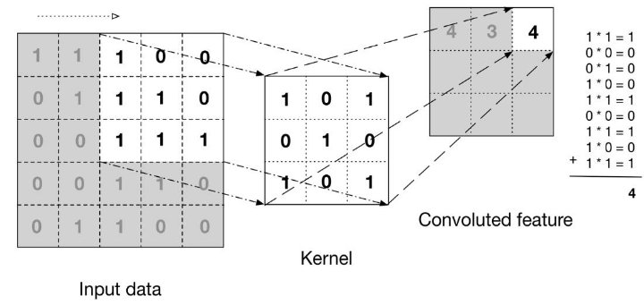
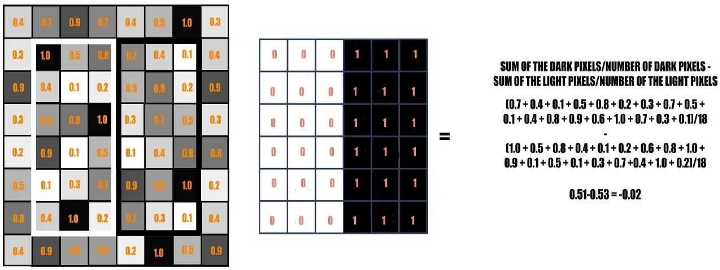

# Facial-Emotion-Detection

|**Facial Emotion Recognition Using**|
| - |
|**Machine Learning** |

**Chapter 2  Research and Approach **

1. **Convolution Neural Network** 

In deep learning, a convolutional neural network (CNN/ConvNet) is a class of deep neural networks most commonly applied to analyze visual imagery. 

How does it Work? 

An RGB image is nothing but a matrix of pixel values having three planes whereas a grayscale image is the same but it has a single plane. Take a look at this image to understand more. 

For Simplicity lets use grayscale images as to explain how CNN works easily. 

Convolutional neural networks are composed of multiple layers of artificial neurons. 

When you input an image in a CNN, each layer generates several activation functions that are passed on to the next layer. 

The first layer usually extracts basic features such as horizontal or diagonal edges. This output is passed on to the next layer which detects more complex features such as corners or combinational edges. As we move deeper into the network it can identify even more complex features such as objects, faces, etc. 

Based on the activation map of the final convolution layer, the classification layer outputs a set of confidence scores (values between 0 and 1) that specify how likely the image is to belong to a “class.”  

For instance, if you have a ConvNet that detects emotions like, anger, and happy, the output of the final layer is the possibility that the input image contains any of those emotions.   (Sa**P**h**A**a**G**, 20**E 7**18)  

2. **Available Types of Dataset for Facial Emotion Recognition.** 

Below, are the top six datasets for emotion recognition, listed in no particular order. 

**1| AffectNet** 

One of the most comprehensive datasets for analyzing face expression in still photos, AffectNet includes both category and dimensional models. 1250 emotion-related tags in 12 distinct languages— English, German, Spanish, Portuguese, Arabic, and Farsi—were used to collect the dataset. The dataset has more than a million pictures of faces and points that can be used to identify faces. They were collected from search engines with a thousand two hundred and fifty keywords from six languages altogether. Around four-hundred and fifty thousand images were manually annotated by 12 experts. 

**2| Ascertain** 

Using physiological responses, Ascertain is a multimodal database for implicit personality and affect recognition that can be used to identify personality traits and emotional states. The dataset includes 58 users' big-five personality scores and emotional self-ratings as well as synchronously recorded EEG, ECG, Galvanic Skin Response (GSR), and facial activity data, all of which were taken while the participants were watching affective movie clips. 

**3| Dreamer** 

Affect is elicited via audio-visual stimuli in the multi-modal database Dreamer, which contains electroencephalogram (EEG) and electrocardiogram (ECG) records. In this dataset, signals from 23 people were captured along with their self-reported ratings of emotional valence, arousal, and dominance following each stimulus. 

**4| CK+, the Extended Cohn-Kanade Dataset** 

A widely used benchmark dataset for action units and emotion identification is the Extended Cohn- Kanade Dataset (CK+). The collection includes 123 individuals and a total of 5,876 tagged pictures with sequences ranging from neutral to peak expression. The CK+ dataset contains 640 by 490 pixel images that are all staged against uniform backdrops. 

**5| EMOTIC** 

A library of pictures of real-world individuals in context that has been annotated with their apparent emotions is called EMOTIC or EMOTIon recognition in Context. The 26 discrete categories in the EMOTIC dataset are combined with the continuous dimensions of valence, arousal, and dominance to represent two distinct forms of emotion. The dataset includes 34, 320 labeled persons and 23, 571 photos. In actuality, using the Google search engine, some of the photographs were personally gathered from the internet. 

**6| FER-2013** 

The training set of the FER-2013 dataset consists of 28,000 labelled images, whereas the development set and test set each have 3,500 tagged images. The dataset was produced by compiling the outcomes of Google image searches for each emotion and its synonyms. The seven emotions that are assigned to each image in the FER-2013 dataset—happy being the most common—are sad, angry, fear, surprised, disgusted, and neutral.    (Chowdhury, 2020) 

3. **HaarCascade Classifier** 

Identifying a custom object in an image is known as object detection. This task can be done using several techniques, but This project will use the haar cascade, the simplest method to perform face detection in this project. 

Haar Cascade were first introduced in 2001, and it was one of the most popular object detection algorithms in OpenCV. Haar cascade is an algorithm that can detect objects in images, irrespective of their scale in image and location. This algorithm is not so complex and can run in real-time. We can train a haar-cascade detector to detect various objects like cars, bikes, buildings, fruits, faces etc. 

Haar cascade uses the cascading window, and it tries to compute features in every window and classify whether it could be an object. 

*Figure 4 https://towardsdatascience.com/face-detection-with-haar-cascade-727f68dafd08 A sample of features by Voila and Jones Research paper*

*Figure 5 https://towardsdatascience.com/face-detection-with-haar-cascade-727f68dafd08 A sample of features by Voila and Jones Research paper* 

The rectangle on the left is a sample representation of an image with pixel values 0.0 to 1.0. The rectangle at the center is a haar kernel which has all the light pixels on the left and all the dark pixels on the right. The haar calculation is done by finding out the difference of the average of the pixel values at the darker region and the average of the pixel values at the lighter region. If the difference is close to 1, then there is an edge detected by the haar feature.   (Jaiswal, 2022) 

**Chapter 3   Implementation **

1. **Chosen Dataset for Project.** FER-2013 

Since FER-2013 is mostly used for recognizing the facial emotions because of its easy availability and  This project also uses the FER-2103 for training of Convolution Neural Network.  

However, AffectNet is probably most accurate till now because of the huge quantity of dataset with 0.4 million images.  However, Importing the 122 GB dataset and running model requires extensive GPU usage and cloud systems like AWS  and it is quite time consuming when tuning the hyperparameters to increase the accuracy of model. Since, Uploading the 122 GB Dataset on Google Collab requires plenty of time and it was not best choice to select for the project in terms of time consumption. University of Denver provides the AffectNet dataset by filling application by using university student email address and email is sent to download the AffectNet Dataset.  

FER 2013 data consists of 48x48 pixel grayscale images of faces. There are seven categories for each training and testing dataset (Angry, Disgust,  Fear, Happy, Sad, Surprise, Neutral). 

The Dataset is collected from Kaggle Website . This dataset was prepared by Pierre-Luc Carrier and Aaron Courville, as part of an ongoing research project and later it was used as challenge competition of $500 for Facial Emotion Recognition on Kaggle Website 

It has 28731 images in training dataset and 7066 images in testing dataset and it is only 50 mb zip file. FER 2013 dataset consists of following number of images for each Categories  

For Training Dataset  For Testing Dataset Happy   7164        1825 

Neutral  4982        1216 

Disgust    436       111 

Angry      3993        960 

Sad         4938                                                           1139 

Fear        4103                                                            1018 

Surprise   3205                                                            797 

     

Disgust                Angry                     Fear                Happy             Neutral              Sad                   Surprise 

2. **Convolution Neural Network Summary** 

Architecture for my project contains four convolution neural network and two fully connected dense layers 

Data Preprocessing: Creating Training and Validation Batches 

Data preprocessing is a step in the data mining and data analysis process that takes raw data and transforms it into a format that can be understood and analyzed by computers and machine learning. 

1. Batch Size 
- Batch Size is chosen as 64 so that instead of loading 28731 images at once in model will require extensive amount of memory and hence will slow the speed of processing. So instead of 28731 images at once, we will send 64 images batches each time. 
- Error values will be stored for each image if not, split in batches and it will require lot of memory to store those error. In batches, error will be stored once for each batch of image. 
- Moreover, Splitting dataset in batches will allow hyperparameter (weight and bias) to change after every batch which will increase accuracy and without splitting, hyperparameter will only change once model is finished.  (P, medium.com, 2019) 
2. Image Data Generator 
- ImageDataGenerator (module in Keras which is used for augmentation of dataset) is used to flip the data horizontally to augment the dataset so that model have more variant of images). 

Convolution Neural Network Layers 

1. *First Convolution Layer*** 

First Convolution Layer has 64 (3x3) filter for Convolution which means images will be multiplied with Kernel (3x3) 64 times.  

Filter value for each layer are randomly initialized based on either Normal or Gaussian distribution. 

Padding “same” is selected for convolution which means “0” values are added on the borders of images so that size of images will not reduce when multiplied with filter. 

Next, Batch normalization is done, it is the layer that allows every layer of the network to do learning more independently. It is used to normalize the output of the previous layers. 

Furthermore, Dropouts layer is added, Dropout are the regularization technique that is used to prevent overfitting in the model. Dropouts are added to randomly switching some percentage of neurons of the network. In this case 20% percentage of neurons are switched off  

Dropouts puts some input value (neuron) for the next layer as 0, which makes the current layer a sparse one. So it reduces the dependence of each feature in this layer. 

Lastly, Max pooling layer allows down sampling which directly remove some input, and that makes the layer "smaller" rather than "sparser".   (stackexchange, n.d.) 

Activation Function chosen for Convolution is RELU as it provides linear transformation of data. 

2. *Remaining Convolution Layers and Fully Connected Layer* 

2nd Layer has 128 filters of 5x5 

3rd layer of Convolution has 512 filters of 3 x 3 4th layer of Convolution has 512 filters of 3 x 3  

3. Additional Hyperparameters for Convolution Neural Network Base Model 
- Epochs 

Number of epochs for initial training is 200 that means model will train for 200 times to get better accuracy for updating weights and reducing loss. 

- ReduceLROnPlateau  

It is used to reduce or increase the learning rate during the training if the gradient loss is not decreasing. 0.01 is value for base model without tuning.                                               (pytorch, n.d.) (Oheix, 2018) (htt) (stackoverflow, n.d.) 

- Optimizer 

Optimizers help to know how to change weights and the learning rate of neural network to reduce the losses.  

`  `*Activation Map* 

Image from Surprise Category is selected to create a activation map of each convolution layer . Activation maps are generated by applying Filters or Feature detectors to the input image or the feature map output of the prior layers. Activation map visualization will provide insight into the internal representations for specific input for each of the Convolutional layers in the model. 

We can see that eyes, nose and mouth are prominent features in filter 64 and 128 as other pixel are almost blurred and only nose, ear and mouth are visible. 

Watching how CNN learns to recognize various elements present in photos on the inside offers a deeper understanding of the model's operation. Understanding the potential causes of the model's failure to accurately classify some of the photos can also aid in fine-tuning the model for greater accuracy and precision.  (Khandelwal, 2020) 

**convolution layer with filter size 64**   

`  `**convolution layer with filter size 128**   

`  `**convolution layer with filter size 256**   

3. **Project Structure** 

Video Streaming Facial Emotion Detection →CNN model.py 

- Camera.py 
- Main.py 
- Haarcascade\_frontalface\_alt2.xml 
- Templates 

`  `------→index.html 

1. Detecting Faces Using OpenCV Library (camera.py) 

After finishing the CNN model. Model weights are saved in h5 format(which is HDF format used to store multidimensional array data in Keras Module. In addition Model is saved in JSON file.    

(fileformat.com, n.d.) 

Both of these files are imported in camera.py where Haarcascade Classifier function is built to detect faces. When the faces are detected, we use our saved model and model weights to detect emotions of faces. 

2. Creating the Webpage for Video streaming. (index.html) 

A sample webpage is created by creating an HTML. Webpage includes the name of the project and name of the course along with number of emotions it will detect in bulleted lists. Each emotion in bulleted lists has a hyperlink which will direct the user towards some of sample images of that emotion category. For instance if we click on any happy emotion, it will direct user to google drive folder of happy emotion sample images  

HTML for webpage is stored in templates folder with file name “index.html”. Webpage looks like below 

3. Creating Video Streaming Server (main.py) 

Now as faces have been detected using haarcascade and webpage have been built to display video, we will integrate these two modules with our server. Server is developed using flask app module in python. The routing decorater has been given the URL path of http:/localhost:5000/.  

**Chapter 4  Results**

Accuracy and Loss Graph of Model 

Base model of CNN has accuracy of ~84% on training set and ~66% on test set after 200 epochs.  

Confusion Matrix for CNN model 

Confusion Matrix tells us that our model has been able to detect happy images better than other emotions with 481 images predicted same as true test values and it has most bright blue color in confusion matrix.  

However, model misinterprets the neutral images  as happy images or happy images as neutral images. 350 Neutral images has been misinterpret as happy and vice versa. 

Morever, Disgust images has been most misclassified as most of disgust are misclassified as other categories. 

Since, the dataset is sparsed in way that happy images are 7136 and disgust are only 436. It is one of reason that mostly images which are misclassified are placed in happy category because of large sample of happy images.  

Images of Different Emotion Detected on Webpage 

**Chapter no 5 Conclusion **

1. **Challenges in Project.** More amount of Data 

Deep learning algorithms are taught to gain knowledge incrementally from data. To ensure that the machine produces the desired results, large data sets are required. Similar to how the human brain needs a lot of experiences to learn and make inferences, an artificial neural network also needs a lot of information. More parameters need to be tuned and more parameters need more data the more powerful an abstraction you want.             (shrivastava, 2017) 

FER-2013 dataset is not massive dataset to train the facial emotion recognition model. It has only images of 48x48 pixel images and even if we augment the dataset, it does not make much difference as images pixels are very not high resolution. Even after augmenting the original dataset did not improve much testing accuracy as it went only upto 67% after 200 epochs which is only 2% more than without augmented model. 

Since, Google Collab was used to CNN model, it took a huge amount of time to run the model and if we were to use AffectNet which is dataset of 122GB images sample. It will require high processing machine to fit the model.  

Data scientists switch to multi-core, high performance GPUs and similar processing units to ensure better efficiency and less time consumption.These processing units are expensive and use a great deal of electricity. 

Thus, even after changing parameters like dropout to 0.2 to 0.3 or lower values, or using different types of optimizers, activation functions, learning rate, accuracy only reached maximum of 67%. One of reason for that is also sparse number of images in each category. For instance, Happy has most images of 7164 while disgust emotion only had 436. 

Hyperparameter Tuning 

Hyperparameters are parameters whose value is established before the learning process even begins. The performance of your model can be significantly altered by slightly altering the value of such parameters. 

The model performance can be significantly impacted if default parameters are used and hyperparameter optimization is not performed. Another factor that affects performance is having too few hyperparameters and manually tuning them as opposed to optimizing using tested techniques. 

Hyperparameter Tuning in model requires lot of time and changing the parameter and evaluating model again was not time efficient in Google colab. 

Sometimes tuning too many parameters in model can also cause model to become overfit which means model performs better on training rather than test. 

2. **Insight and Improvement Techniques** 

Generating the CNN from scratch is not efficent and productive, there are many pre trained models available online which perform much better in terms of accuracy and there is not much need of tuning the hyperparameters in it. One of pre trained model which is available is VGG-16 

VGG-16 is a convolutional neural network that is 16 layers deep. You can load a pretrained version of the network trained on more than a million images from the ImageNet database [1]. The pretrained network can classify images into 1000 object categories. 

In addition, Pre trained models like ResNet, AlexNet also perform great for classification of the objects. 

Machine learning and deep leaning modelling requires significant subject matter expertise, access to high quality labeled data, as well as computational resources for continous model training and refinement. 

`       `Improvement Techniques. 

- Data Augmentation** 

Increase the training and validation set by vertical and horizontal flipping , translation ( image is moved along X, Y direction) ,cropping ,zooming ,darkening & brightening/color modification ,gray scaling ,changing contrast ,adding noise ,random erasing.** 

**PAGE 21** 

**References** 

(n.d.). Retrieved from https://stackoverflow.com/questions/61661148/shape-error-when-fitting-my-

data-to-vgg16-cnn-keras?rq=1 

Anderson, M. (2022, July 05). *Iflexion.com*. Retrieved from Iflexion: 

https://www.iflexion.com/blog/emotion-recognition-software 

Chowdhury, A. (2020, September 23). *AnalyticsIndiamag.* Retrieved from 

https://analyticsindiamag.com/top-8-datasets-available-for-emotion-detection/ 

*fileformat.com*. (n.d.). Retrieved from 

https://docs.fileformat.com/misc/h5/#:~:text=H5%20File%20Viewer- ,What%20is%20an%20H5%20file%3F,for%20quick%20retrieval%20and%20analysis 

Fulmer, J. (2021, September 21). *itbusinessedge*. Retrieved from 

https://www.itbusinessedge.com/business-intelligence/value-emotion-recognition- technology/ 

Jaiswal, A. (2022, September 27). *AnalyticsVidhya.* Retrieved from 

https://www.analyticsvidhya.com/blog/2022/04/object-detection-using-haar-cascade- opencv/ 

Khandelwal, R. (2020, May 18). *towardsdatascience*. Retrieved from 

https://towardsdatascience.com/convolutional-neural-network-feature-map-and-filter- visualization-f75012a5a49c 

Matsumoto, D. (2021, April 06). *humintell*. Retrieved from 

https://www.humintell.com/2021/04/benefits-of-reading-facial-expressions-of-emotion/ 

Oheix, J. (2018). *kaggle.* Retrieved from https://www.kaggle.com/datasets/jonathanoheix/face-

expression-recognition-dataset 

P, B. K. (n.d.). Retrieved from (NOV 2019) URL:https://medium.com/analytics-vidhya/when-and-

why-are-batches-used-in-machine-learning-acda4eb00763 

P, B. K. (2019, Nov). *medium.com.* Retrieved from https://medium.com/analytics-vidhya/when-and-

why-are-batches-used-in-machine-learning-acda4eb00763 

*pytorch*. (n.d.). Retrieved from 

https://pytorch.org/docs/stable/generated/torch.optim.lr\_scheduler.ReduceLROnPlateau.ht ml  

Saha, S. (2018, December 18). Retrieved from URL: https://towardsdatascience.com/a-

comprehensive-guide-to-convolutional-neural-networks-the-eli5-way-3bd2b1164a53 

*stackexchange*. (n.d.). Retrieved from https://ai.stackexchange.com/questions/9563/is-pooling-a-

kind-of-dropout 

*stackoverflow*. (n.d.). Retrieved from https://stackoverflow.com/questions/35572000/how-can-i- plot-a-confusion-matrix  **PAGE 21** 

shrivastava, p. (2017, September 13). *Hackernoon.* Retrieved from 

https://hackernoon.com/challenges-in-deep-learning-57bbf6e73bb 

**PAGE 24** 
